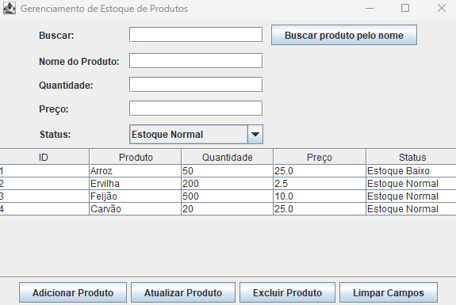

# Gerenciador de Estoque de Produtos

## Descrição

O **Gerenciador de Estoque de Produtos** é uma aplicação Java desenvolvida para facilitar o gerenciamento de produtos em estoque. Com uma interface gráfica simples e intuitiva, a aplicação permite adicionar, atualizar, excluir e buscar produtos, além de listar todos os itens disponíveis. Utiliza o banco de dados **SQLite** para armazenamento dos dados.

## Funcionalidades

- **Adicionar Produtos**: Insira nome, quantidade, preço e status do produto no estoque.
- **Atualizar Produtos**: Modifique as informações dos produtos existentes.
- **Excluir Produtos**: Remova produtos do banco de dados.
- **Buscar Produtos**: Pesquise produtos pelo nome.
  
## Tecnologias Utilizadas

- **Java (Swing)** para a interface gráfica.
- **SQLite** para o armazenamento dos dados.

## Pré-requisitos

- **Java JDK 8+** instalado.
- Uma IDE de sua escolha para executar o projeto.

## Como Usar

1. **Clone o repositório:**

   ```bash
   Abra o projeto na sua IDE.
   Execute a classe AppMain para iniciar a aplicação.
   Crie a tabela de produtos (se não existir) ao iniciar a aplicação.
   Utilize a interface gráfica para gerenciar os produtos.

## Imagem da Interface



## Contribuição

Contribuições são bem-vindas! Sinta-se à vontade para abrir um **issue** ou enviar um **pull request**.

## Licença

Este projeto é licenciado sob a [Apache License 2.0](LICENSE).
