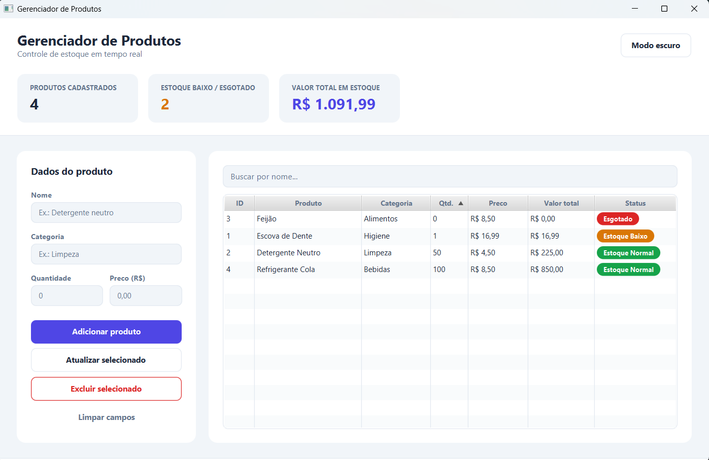

# Gerenciador de Estoque

Aplicacao desktop para controle de estoque, construida em **Java 21 + JavaFX**, com persistencia em **SQLite** e arquitetura em camadas (model / repository / service / ui). Originalmente um projeto Swing simples feito no Eclipse, reescrito do zero para praticar boas praticas de organizacao de codigo Java.



## Destaques

- **Status de estoque calculado automaticamente.** Nada de escolher manualmente "Estoque Baixo" em um combo box: o status (`Normal`, `Baixo`, `Esgotado`) e derivado da quantidade em tempo real, então nunca fica inconsistente com o numero real de itens.
- **Dashboard com indicadores.** Total de produtos cadastrados, quantos estão com estoque baixo/esgotado e o valor total parado em estoque, sempre recalculados a cada alteração.
- **Busca instantânea.** A tabela é filtrada a cada letra digitada, sem round-trip ao banco a cada tecla (usa `FilteredList` + `SortedList` do JavaFX).
- **Modo escuro.** Alternável por um botão no cabeçalho, trocando apenas variáveis de cor no CSS.
- **Arquitetura em camadas**, com uma interface (`ProdutoRepository`) separando a regra de negócio do SQL, o que também permite testar o `ProdutoService` com um repositório falso em memória, sem precisar de banco de dados.
- **Testes automatizados** com JUnit 5: regras de validação e cálculo de status testadas isoladamente, e o repositório SQLite testado de ponta a ponta contra um banco real (em arquivo temporário).

## Tecnologias

| Camada          | Tecnologia                          |
|-----------------|--------------------------------------|
| Interface       | JavaFX 21 (FXML + CSS)               |
| Persistência    | SQLite (via `sqlite-jdbc`)           |
| Build           | Maven                                |
| Testes          | JUnit 5                              |
| Linguagem       | Java 21                              |

## Estrutura do projeto

```
src/main/java/com/gerenciadorprodutos/
├── App.java                  # ponto de entrada (JavaFX Application)
├── model/                    # Produto, StatusEstoque
├── exception/                # exceções de validação/persistência
├── database/                 # conexão e criação do schema SQLite
├── repository/                # acesso a dados (interface + implementação SQLite)
├── service/                  # regras de negócio e validações
└── ui/                       # controller da tela (MainController)

src/main/resources/
├── schema.sql                 # script de criação da tabela
└── com/gerenciadorprodutos/ui/
    ├── main-view.fxml         # layout da tela
    └── styles.css             # tema claro/escuro

src/test/java/com/gerenciadorprodutos/
├── service/                   # testes de regra de negócio (repositório falso em memória)
└── repository/                # testes de integração contra SQLite real
```

## Como rodar

Pré-requisitos: **JDK 21+** e **Maven** (ou use a extensão Maven do VS Code, que baixa um Maven embutido automaticamente).

```bash
mvn javafx:run
```

Ao abrir pela primeira vez, um arquivo `estoque.db` é criado automaticamente na raiz do projeto com a tabela de produtos - não é preciso configurar nada manualmente.

### Rodando os testes

```bash
mvn test
```

## Regras de negócio

- Nome não pode ficar em branco; quantidade e preço não podem ser negativos.
- O status de cada produto é recalculado a partir da quantidade: `0` unidades = **Esgotado**, menos de `10` = **Estoque Baixo**, caso contrário = **Estoque Normal**.
- O id de cada produto é gerado pelo próprio SQLite (`AUTOINCREMENT`) no momento da inserção.

## Possíveis evoluções

- Exportar a listagem de produtos para CSV/PDF.
- Histórico de movimentações de estoque (entradas/saídas), em vez de só o saldo atual.
- Empacotar a aplicação como executável nativo com `jpackage`.
